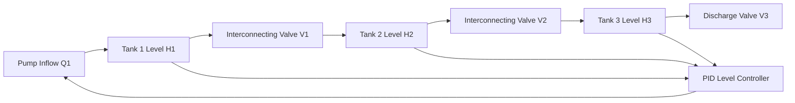

# Industrial 3-Tank Digital Twin & Supervision

---

## 📌 Project Overview

Web-based industrial supervision application for a three-tank system. Features real-time level and flow rate visualization, interactive valve control, and pedagogical digital twin interface for industrial automation training.

This project is an engineering module built by **DJIDEL Abdelali Rayan** (Systems & Automation Engineer, USTHB).

---

## 🏗️ System Architecture & Data Flow

---

## 🛠️ Key Technologies & Frameworks

- **React**
- **Real-time Simulation**
- **Industrial Supervision**
- **SVG Animation**
- **PID Regulation**

---

## 🚀 Live Interactive Web Demo

No installation required! Test and interact with the full web simulation live in your browser:
🔗 **[Launch Interactive Web Demo](https://djidelabdelali.github.io/industrial-3tank-digital-twin/)**

---

## 🔗 Connected Portfolio Ecosystem

- 🌐 **Main Portfolio**: [djidelabdelali.github.io/portfolio](https://djidelabdelali.github.io/portfolio/)
- 💻 **GitHub Profile**: [github.com/DjidelAbdelali](https://github.com/DjidelAbdelali)
- 💼 **LinkedIn Profile**: [DJIDEL Abdelali Rayan](https://linkedin.com/in/djidel-abdelali-rayan-814b25207)

---

  Developed by DJIDEL Abdelali Rayan — Systems & Automation Engineering

